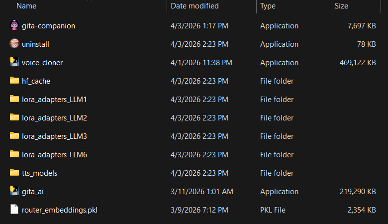

# 🕉️ Gita AI — Bhagavad Gita Mental Health Companion

A desktop application that provides mental health support grounded in the teachings of the Bhagavad Gita. It uses four LoRA-finetuned Llama 3.2 models — each specializing in a different chapter — and a semantic router that picks the most relevant model for every question.

Built with **Tauri 2 + React** (frontend) and a **PyInstaller-compiled Python CLI** (AI backend).

---

## ✨ Features

- **Semantic Router** — Embeds your question and votes across four LoRA experts using cosine similarity
- **4 Specialized LoRA Adapters** — Each finetuned on a different chapter of the Gita for a different emotional context
- **Real-time Routing Panel** — Animated score bars show which model was chosen and why
- **Fully Offline After Setup** — Models are cached locally; no internet required after first-time setup
- **No Black CMD Window** — Python backend runs silently in the background

---

## 🧠 The Four AI Models

| Model | Chapter | Theme | Best For |
|-------|---------|-------|----------|
| LLM-1 | Chapter 1 · Vishada | Crisis & Despair | Panic attacks, overwhelming anxiety, decision paralysis |
| LLM-2 | Chapter 2 · Sankhya | Resilience | Cognitive restructuring, unmet expectations, emotional stability |
| LLM-3 | Chapter 3 · Karma | Action | Burnout, lethargy, lack of purpose, breaking inertia |
| LLM-6 | Chapter 6 · Dhyana | Mindfulness | Racing mind, overthinking spirals, grounding techniques |

---

## 🚀 Quick Setup (Recommended)

This is the fastest way to get the app running — no Python or Rust required.

### Step 1 — Download the Installer

👉 **[Download Gita Companion Setup (Windows x64)](https://github.com/rambo1111/mental_health_gita_ai_companion/releases/download/gita_ai_companion/Gita.Companion_1.0.0_x64-setup.exe)**

Run the installer. It installs `gita-companion.exe` on your machine.

---

### Step 2 — Download the AI Backend Files

👉 **[Download extras_gita_ai.zip (~2.3 GB) from Google Drive](https://drive.google.com/file/d/1m1PQCNBJJiVMaMyp-KOryJKSfNvjgGbo/view?usp=sharing)**

This zip contains everything the AI needs to run offline:

```
extras_gita_ai.zip
├── hf_cache\              ← pre-downloaded model weights (~2 GB)
├── lora_adapters_LLM1\
├── lora_adapters_LLM2\
├── lora_adapters_LLM3\
├── lora_adapters_LLM6\
├── gita_ai.exe            ← Python AI backend
└── router_embeddings.pkl
```

---

### Step 3 — Set Up the Final Folder

Extract `extras_gita_ai.zip` anywhere you like. Then **copy `gita-companion.exe`** (from Step 1's installation directory) into that same folder.

Your folder should look exactly like this:



> **Where is `gita-companion.exe` after installing?**  
> Check `C:\Program Files\Gita Companion\` or wherever the installer placed it.

---

### Step 4 — Run the App

Double-click **`gita-companion.exe`** from inside that folder.

> ⚠️ **Important:** Always launch `gita-companion.exe` from the folder where `gita_ai.exe` lives. The app needs all files to be in the same directory.

The app will start, load the AI models from `hf_cache\`, and be ready to chat in about 30–60 seconds.

---

## 🏗️ Build From Source

Only follow this section if you want to modify the code and rebuild everything yourself.

### Prerequisites

- Windows 10/11 (64-bit)
- [Node.js 18+](https://nodejs.org/) and npm
- [Rust + Cargo](https://rustup.rs/)
- Python 3.10+ with pip

---

### 1. Clone the Repository

```powershell
git clone https://github.com/rambo1111/mental_health_gita_ai_companion.git
cd mental_health_gita_ai_companion
```

---

### 2. Build the Python Backend

```powershell
cd gita-ai
python -m venv .venv
.venv\Scripts\activate
.\build.bat
```

This produces `dist\gita_ai.exe`. Copy it alongside `router_embeddings.pkl` and the four `lora_adapters_LLM*\` folders into a deployment folder.

**First-run model download (WiFi required once):**

```powershell
.\gita_ai.exe --interactive
```

Wait for `✅ System ready!` — this downloads the base model and sentence transformer into `hf_cache\` (~2 GB). After this the app runs fully offline.

---

### 3. Build the Desktop App

```powershell
cd ..\gita-companion
npm install
npm run tauri build
```

The portable exe will be at:
```
src-tauri\target\release\gita-companion.exe
```

Copy it into your deployment folder alongside everything else.

---

### Final Deployment Folder Layout

```
📁 your-deploy-folder\
├── 📁 hf_cache\
├── 📁 lora_adapters_LLM1\
├── 📁 lora_adapters_LLM2\
├── 📁 lora_adapters_LLM3\
├── 📁 lora_adapters_LLM6\
├── 🖥️ gita_ai.exe
├── 🖥️ gita-companion.exe
└── 📄 router_embeddings.pkl
```

---

## 🔧 Tech Stack

| Layer | Technology |
|-------|-----------|
| Desktop shell | Tauri 2 (Rust) |
| Frontend | React 18 + TypeScript + Vite |
| State management | Zustand |
| AI backend | Python 3.10, PyInstaller |
| LLM | Llama 3.2 1B Instruct (Unsloth) |
| Fine-tuning | LoRA via PEFT |
| Router | SentenceTransformers (all-MiniLM-L6-v2) + cosine similarity |
| Inference | Transformers + PEFT (float16; 4-bit with bitsandbytes) |

---

## 🏛️ Architecture

```
gita-companion/          ← Tauri 2 desktop app (React + TypeScript)
  src/                   ← React UI (chat, routing panel, status bar)
  src-tauri/             ← Rust backend
    commands/ai.rs       ← Spawns gita_ai.exe, parses stdout over IPC
    commands/system.rs   ← File checks, exe directory resolution

gita-ai/                 ← Python AI backend
  gita_ai.py             ← Router + LoRA inference CLI
  build.bat              ← PyInstaller build → gita_ai.exe
```

Rust spawns `gita_ai.exe --interactive` silently and communicates over piped stdin/stdout. Questions go in as plain text; structured routing scores and responses come back as formatted stdout lines.

---

## ⚠️ Notes

- **bitsandbytes** is optional — without it the model runs in float16 (slightly slower but fully functional)
- The `hf_cache\` folder must travel with the app — it contains the model weights
- For 4-bit quantized inference (faster, lower RAM): `pip install bitsandbytes` then rebuild `gita_ai.exe`

